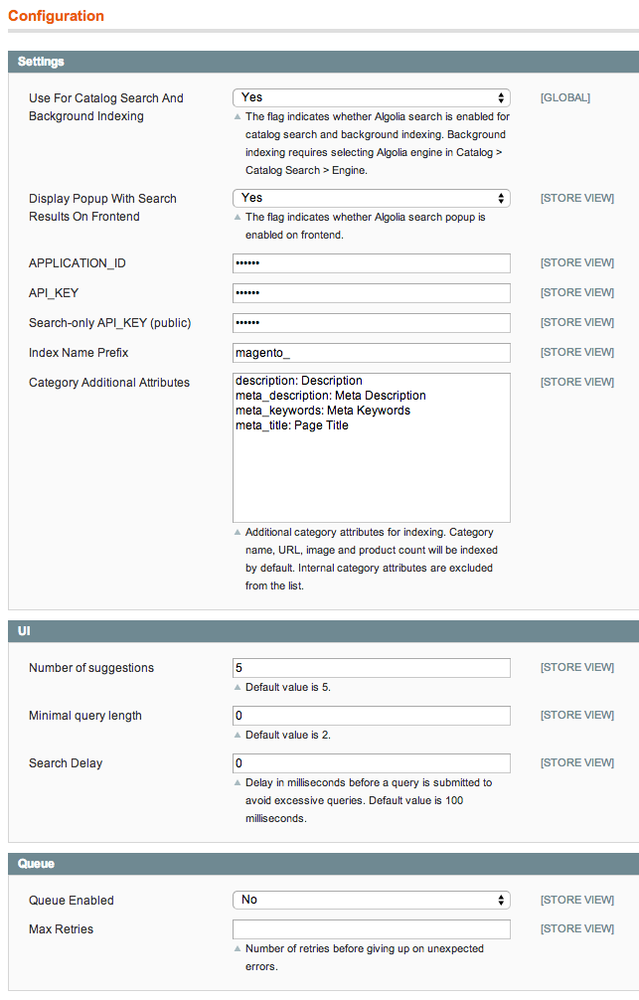

Algolia Search for Magento
==================

[Algolia Search](http://www.algolia.com) is a search API that provides hosted full-text, numerical and faceted search.
Algolia’s Search API makes it easy to deliver a great search experience in your apps & websites providing:

 * REST and JSON-based API
 * search among infinite attributes from a single searchbox
 * instant-search after each keystroke
 * relevance & popularity combination
 * typo-tolerance in any language
 * faceting
 * 99.99% SLA
 * first-class data security


This module let you easily integrate the Algolia Search API to your Magento instance. The module is based on [algoliasearch-client-php](https://github.com/algolia/algoliasearch-client-php) and [algoliasearch-client-js](https://github.com/algolia/algoliasearch-client-js).


Installation
--------------

### Using the packaged Community Extension

To setup this module using the packaged Community Extension, download the last version from our [releases](https://github.com/algolia/algoliasearch-magento/tree/master/releases) directory and upload it on your Magento instance.

### Using Modman

To setup this module using [modman](https://github.com/colinmollenhour/modman) (a module manager for Magento) run the following commands:

```sh
$ cd /path/to/your/magento/directory
$ modman init
$ modman clone https://github.com/algolia/algoliasearch-magento.git
```

### Using Composer

To setup this module using [Composer](https://getcomposer.org/) (a dependency manager for PHP), just add ```"algolia/algoliasearch-magento": "*"``` to your ```composer.json``` file.

Features
--------

### Search bar with auto-complete

This extension adds an auto-completion menu to your search bar displaying products and categories "as-you-type".


### Typo-tolerated full-text search

This extension is also able to replace the default full-text search engine handling typo-tolerance.


Configuration
--------------

To setup this module, you'll need an Algolia account. Just sign up [here](http://www.algolia.com/users/sign_up) to create an account and retrieve your credentials.

### Credentials & Settings

Once the extension is installed, a new **Algolia Search** menu will appear in your **System > Configuration** menu.


In the configuration panel, you'll be able to setup your credentials as well as some other configuration variables.



To replace the full-text search engine of your Magento instance, please select **Algolia** in your **System > Catalog > Catalog Search > Search Engine** section:


Initial import
-----------------

Once configured, do not forget to trigger the re-indexing in **System > Index Management**:


Customization
------------

### Style

Feel free to update the default style modifying ```skin/frontend/base/default/algoliasearch/algoliasearch.css```.

### Observers

We're dispatching events allowing you to customize the default behavior of the extension. You can add observers on the following events:

 * ```algolia_product_index_before```: triggered for each product, ability to add custom attributes using ```$observer->getCustomData()```.
 * ```algolia_category_index_before```:  triggered for each category, ability to add custom attributes using ```$observer->getCustomData()```.

### Instant-search

If you want to build an instant-search based result page refreshing the whole page (results, pagination & navigation filters) “as you type” you can follow this [tutorial](http://www.algolia.com/doc/tutorials/instant-search).


